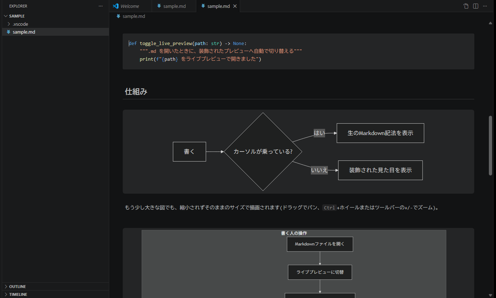
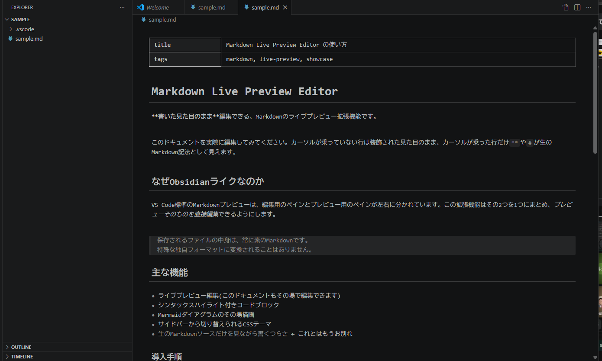
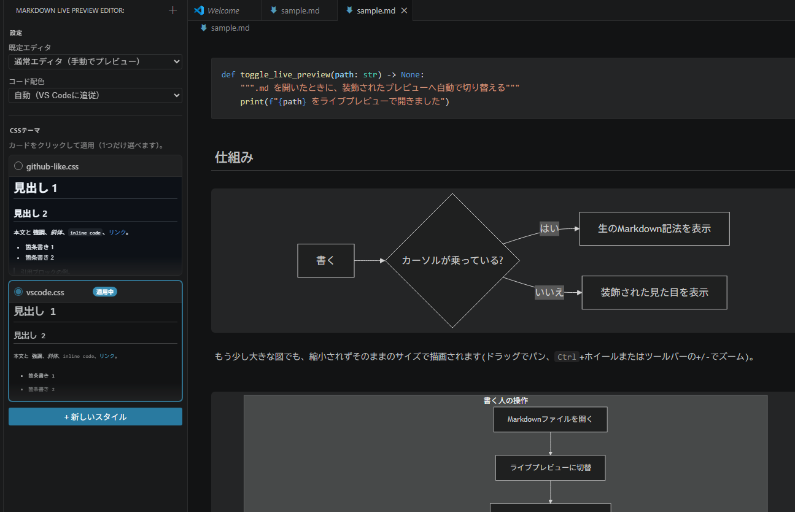
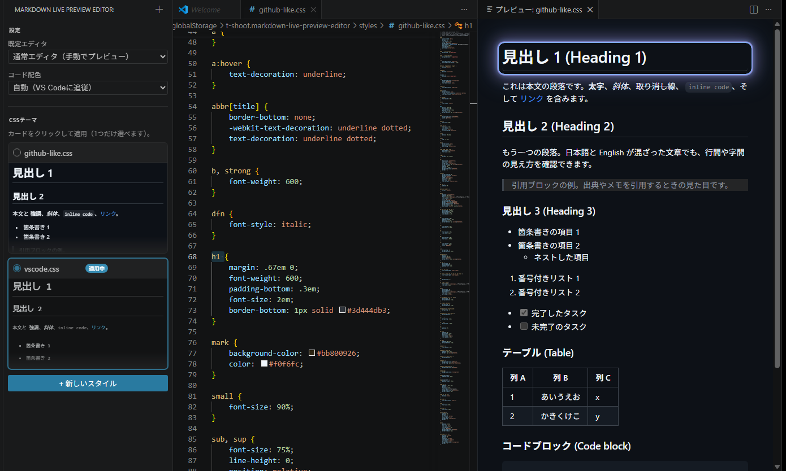

# Markdown Live Preview Editor

[日本語](#日本語) | English

[](https://marketplace.visualstudio.com/items?itemName=t-shoot.markdown-live-preview-editor)
[](https://marketplace.visualstudio.com/items?itemName=t-shoot.markdown-live-preview-editor)
[](https://marketplace.visualstudio.com/items?itemName=t-shoot.markdown-live-preview-editor)
[](LICENSE)



**A VS Code extension that lets you edit the Markdown preview itself, Obsidian-style.**
Your file keeps its formatted look while you type, but what's actually saved to disk is always plain Markdown.

## Why this extension?

VS Code's built-in Markdown preview splits the editing source pane and the preview pane side by side.
This extension merges the two into one.

- The preview itself is editable — type directly into the **styled** view
- Only the line the cursor is on reveals its raw Markdown syntax (`**`, `#`, etc.) — the same experience as Obsidian
- What's saved to the file on disk is always **plain Markdown**. No proprietary format
- Works with your existing `.md` files and Git-tracked documents as-is

## Key features

### Live preview editing
A custom editor built on CodeMirror 6. Headings, emphasis, blockquotes, lists, task lists, links, images, horizontal rules, tables, and more automatically switch between their styled rendering and raw source depending on where your cursor is. `Ctrl+Z` / `Ctrl+Shift+Z` undo/redo work exactly as you'd expect in a normal editor.



### Bold / italic shortcuts
`Ctrl+B` toggles the selection between plain text and `**bold**`; `Ctrl+I` does the same for `*italic*`. Works with no selection too (inserts an empty pair and places the cursor inside) and with multiple cursors at once.

### Find and replace
`Ctrl+F` opens a search panel inside the editor; `Ctrl+H` opens the same panel with the replace field focused. Includes the usual "next match" / "previous match" / "replace" / "replace all" controls.

### Paste and drag-and-drop images
Paste an image from your clipboard (e.g. a screenshot) or drag an image file onto the editor, and it's saved into an `assets/` folder next to the `.md` file, with a `` link inserted at the cursor automatically. File names are generated to avoid collisions.

### Outline (heading list) view
A dedicated "Outline" view in the activity bar lists every heading (h1–h6) in the active Markdown Live Preview document. Click a heading to jump straight to it. The list follows whichever document tab is active and updates as you edit. (VS Code's built-in Outline panel doesn't support webview-based custom editors, so this extension ships its own.)

### Syntax-highlighted code blocks
Fenced code blocks (` ```python `, etc.) are colorized per-language via [Shiki](https://shiki.style/). An `auto` mode follows VS Code's color theme (light/dark), or you can pin a specific palette like GitHub's.

### Mermaid diagrams
` ```mermaid ` fences render as an SVG diagram in place. Moving the cursor into it reveals the raw Mermaid source for continued editing.

### Sidebar CSS theme manager, live-synced while editing
The "CSS Themes" view in the Primary Sidebar lets you register and switch between multiple CSS snippets that restyle the preview. Saving a CSS file hot-reloads any open preview.



Opening a card's edit (pencil) icon shows the CSS file and a sample live preview side by side. **The preview updates on every keystroke**, and whichever rule your cursor sits on (e.g. `h1 { ... }`) glows briefly on the matching preview element, so you can see exactly what a rule affects while you write it.



## Installation

1. Search for "Markdown Live Preview Editor" in VS Code's Extensions view and install it
2. Or from the Marketplace page: [Markdown Live Preview Editor](https://marketplace.visualstudio.com/items?itemName=t-shoot.markdown-live-preview-editor)
3. Or from the command line:
   ```
   code --install-extension t-shoot.markdown-live-preview-editor
   ```

## Quick start

1. Open a `.md` file (it opens in the normal text editor by default).
2. Click the toggle icon at the top right of the editor title bar to switch to Live Preview.
3. Edit directly in the preview. Lines without the cursor show their styled rendering; the line with the cursor shows raw Markdown syntax.
4. Enable a theme from the "CSS Themes" view in the Primary Sidebar if you like.
5. Open the "Outline" view in the Primary Sidebar to jump between headings.

To always open `.md` files in Live Preview, change the `mdLivePreview.defaultEditor` setting to `livePreview`.

## Settings

| Setting | Description |
| --- | --- |
| `mdLivePreview.codeTheme` | Code highlighting palette (`auto` / `dark-plus` / `light-plus` / `github-dark` / `github-light`). `auto` follows VS Code's color theme (light/dark). |
| `mdLivePreview.enabledStyles` | The list of currently enabled CSS snippet IDs (normally managed from the sidebar, not edited directly). |
| `mdLivePreview.defaultEditor` | Controls whether `.md` files default to Markdown Live Preview (`prompt` = keep the normal editor and open Live Preview manually from the toolbar / `livePreview` = always use Live Preview / `default` = always use VS Code's normal text editor). |

## Known limitations

- Code highlighting is limited to a curated set of major languages (JS/TS/Python/Java/C/C++/C#/Go/Rust/Ruby/PHP/HTML/CSS/JSON/YAML/Markdown/Bash/SQL/Kotlin/Swift, etc.). Other languages aren't colorized.
- Editing a table's raw source isn't as smooth as Obsidian's dedicated table UI (moving the cursor into a table reveals the raw pipe syntax as-is).
- Pasting or dropping multiple images at once only inserts the first one.

## Feedback and bug reports

Please use [GitHub Issues](https://github.com/t-shoot/md-live-preview-editor/issues).

## License

[MIT](LICENSE)

---

<details>
<summary><strong>For developers (building or modifying this repository)</strong></summary>

### Setup

```
npm install
npm run compile
```

During development, use the `watch` task already registered in `.vscode/tasks.json` to automatically rebuild and type-check on every save (both the esbuild build and `tsc --noEmit --watch` run in parallel). Run it from VS Code via `Terminal > Run Task... > watch`, or it starts automatically with `F5` (see below).

If you'd like build errors surfaced in VS Code's "Problems" panel, installing the [connor4312.esbuild-problem-matchers](https://marketplace.visualstudio.com/items?itemName=connor4312.esbuild-problem-matchers) extension is recommended (already listed in `.vscode/extensions.json`, so VS Code will offer to install it when you open this folder). The build itself works fine without it.

#### npm scripts

| Script | What it does |
| --- | --- |
| `npm run compile` | Full esbuild build + `tsc --noEmit` type check (runs once) |
| `npm run typecheck` | Type check only |
| `npm test` | Runs the Vitest test suite once |
| `npm run test:watch` | Runs Vitest in watch mode |
| `npm run watch:esbuild` | esbuild in watch mode (build only, no type checking) |
| `npm run watch:tsc` | `tsc --noEmit --watch` (type checking only, in watch mode) |
| `npm run vscode:prepublish` | Production (minified) build; runs automatically during packaging (`vsce package`) |

### Running the extension

1. Open this repository in VS Code.
2. Press `F5` (uses the "Run Extension" configuration in `.vscode/launch.json`; the `watch` task runs automatically first, then a new "Extension Development Host" window opens).
3. In the new window, open the bundled `sample/sample.md`.

With the `watch` task running, changing the code and reloading the Extension Development Host window (`Ctrl+R`) picks up the latest changes.

### Manual verification steps

`sample/sample.md` covers headings (h1–h6), bold, italic, strikethrough, inline code, blockquotes, lists, task lists, links, images, horizontal rules, a `python` code block, `mermaid` blocks (small and large diagrams), and tables (including one with blank cells). Walk through the following:

1. Open `sample/sample.md` in the normal text editor and confirm the toggle icon appears at the top right of the editor title bar.
2. Click it and confirm it switches to Live Preview. Confirm Live Preview also shows a "back to source" icon that returns to the normal editor.
3. Confirm that `**`, `#`, `` ` ``, etc. are hidden on lines without the cursor, and shown as raw text only on the line with the cursor.
4. Confirm a ` ```python ` block is colorized (multiple colors, not a single flat color).
5. Confirm a ` ```mermaid ` block renders as an SVG diagram when the cursor is away, and reverts to raw text editing when the cursor enters it.
6. Edit text in Live Preview and confirm the change is reflected on disk in `sample/sample.md` (or in the same file opened in a normal editor tab).
7. Confirm `Ctrl+Z` undoes exactly one step and `Ctrl+Shift+Z` (or `Ctrl+Y`) redoes exactly one step (no multi-step jumps, no no-ops).
8. Change `sample/sample.md` from outside (editing it in another tab, `git checkout`, etc.) and confirm Live Preview follows along without crashing or duplicating content.
9. Open the "CSS Themes" view in the Primary Sidebar, enable the `GitHub-like` or `Obsidian-like` sample styles, and confirm the appearance changes. Confirm editing and saving a CSS file hot-reloads any open Live Preview.
10. Change the `mdLivePreview.defaultEditor` setting to `livePreview` and confirm `.md` files automatically open in Live Preview (and confirm reverting to `prompt` restores the original behavior).
11. Restart VS Code, reopen `sample/sample.md` in Live Preview, and confirm state such as the enabled CSS theme persisted.
12. Confirm the "動作確認用サンプル" section's h4–h6 headings render progressively smaller, same as the other heading levels.
13. Confirm the "動作確認用サンプル" section's table with blank cells doesn't shift later columns left — blank cells stay in their original column position.
14. Select some text and press `Ctrl+B` / `Ctrl+I`; confirm it toggles `**bold**` / `*italic*` on and back off. With no selection, confirm it inserts an empty pair with the cursor placed inside.
15. Press `Ctrl+F` and confirm the search panel opens inside the editor; press `Ctrl+H` and confirm the same panel opens with the replace field focused. Try "next", "previous", "replace", and "replace all".
16. Copy an image (e.g. a screenshot) and paste it into Live Preview; confirm an `assets/` folder is created beside the file, the image is saved into it, and `` is inserted at the cursor. Try dragging an image file from a file explorer too.
17. Open the "Outline" view in the Primary Sidebar and confirm it lists the document's headings. Click one and confirm the editor jumps to and scrolls to that heading. Switch between multiple Live Preview tabs and confirm the outline follows the active one. Add or remove a heading and confirm the list updates.

</details>

---

## 日本語


**Obsidianのライブプレビューのように、Markdownのプレビュー自体を直接編集できるVS Code拡張機能。**
ファイルの見た目を保ったまま書けて、保存されるのは常に素のMarkdownです。

### なぜこの拡張機能?

VS Codeの標準Markdownプレビューは、編集用のソースペインとプレビューペインが左右に分かれています。
この拡張機能は、その2つを1つにまとめます。

- プレビューそのものが編集可能で、**装飾された見た目のまま**タイプできる
- カーソルが乗っている行だけ`**`や`#`などのMarkdown記法が生テキストで見える(Obsidianと同じ体験)
- ファイルとして保存される中身は常に**素のMarkdown**。特殊な独自フォーマットにはならない
- 既存の`.md`資産やGit管理下のドキュメントをそのまま使える

### 主な機能

#### ライブプレビュー編集
CodeMirror 6ベースのカスタムエディタです。見出し・強調・引用・リスト・タスクリスト・リンク・画像・水平線・テーブルなどの記法が、装飾された表示とソース表示をカーソル位置に応じて自動的に切り替わります。`Ctrl+Z` / `Ctrl+Shift+Z`によるアンドゥ・リドゥも通常のエディタと同じ感覚で使えます。


#### 太字/斜体ショートカット
`Ctrl+B`で選択範囲を`**太字**`に、`Ctrl+I`で`*斜体*`にトグルできます。選択なしでも空のマーカー対を挿入してカーソルを内側に置きます。複数カーソルにも対応しています。

#### 検索・置換
`Ctrl+F`でエディタ内に検索パネルを開きます。`Ctrl+H`は同じパネルを置換欄にフォーカスした状態で開きます。「次を検索」「前を検索」「置換」「すべて置換」などの操作ができます。

#### 画像の貼付・ドラッグ&ドロップ
クリップボードの画像(スクリーンショットなど)を貼り付けたり、画像ファイルをエディタにドラッグ&ドロップしたりすると、`.md`ファイルと同じ場所の`assets/`フォルダに保存され、カーソル位置に``が自動挿入されます。ファイル名は衝突を避けて自動生成されます。

#### アウトライン(見出し一覧)ビュー
アクティビティバーの専用「アウトライン」ビューに、開いているLive Previewの見出し(h1〜h6)が一覧表示されます。クリックすると該当の見出しへジャンプします。一覧はアクティブなタブに追従し、編集内容にあわせて更新されます。(VS Code標準のアウトラインパネルはWebviewベースのカスタムエディタに対応していないため、この拡張機能独自のビューとして実装しています。)

#### シンタックスハイライト付きコードブロック
フェンス付きコードブロック(` ```python `など)を[Shiki](https://shiki.style/)で言語ごとに色分け表示します。VS Codeのカラーテーマ(ライト/ダーク)に自動追従する`auto`モードのほか、GitHub配色などを個別に指定することもできます。

#### Mermaidダイアグラム
` ```mermaid `フェンスをその場でSVG図として描画します。カーソルを入れると生のMermaid記法に戻り、そのまま編集を続けられます。

#### サイドバーのCSSテーマ管理、編集中はプレビューと同期ハイライト
プライマリサイドバーの「CSS Themes」ビューから、プレビューの見た目を変えるCSSスニペットを複数登録・切替できます。CSSファイルを保存すると、開いているプレビューにホットリロードされます。


カードの鉛筆アイコンから編集を開くと、CSSファイルとサンプルのライブプレビューが左右に並びます。**タイプするたびにプレビューが即座に更新され**、さらにカーソルが乗っている規則(例: `h1 { ... }`)に対応する要素がプレビュー側でふわっと光ってハイライトされるので、「このCSSがどこに効いているか」を目で見ながら編集できます。


### インストール

1. VS Codeの拡張機能ビューで「Markdown Live Preview Editor」を検索してインストール
2. またはMarketplaceのページから: [Markdown Live Preview Editor](https://marketplace.visualstudio.com/items?itemName=t-shoot.markdown-live-preview-editor)
3. またはコマンドラインから:
   ```
   code --install-extension t-shoot.markdown-live-preview-editor
   ```

### クイックスタート

1. `.md`ファイルを開く(既定では通常のテキストエディタで開きます)。
2. エディタタイトルバー右上の切替アイコン(プレビューを開くボタン)をクリックし、Live Previewに切り替える。
3. プレビュー上で直接編集する。カーソルが乗っていない行は装飾表示、カーソルが乗った行だけ生のMarkdown記法が見える。
4. プライマリサイドバーの「CSS Themes」ビューから好みのテーマを有効化する。
5. プライマリサイドバーの「アウトライン」ビューから見出し間をジャンプできる。

`.md`ファイルを常にLive Previewで開きたい場合は、設定`mdLivePreview.defaultEditor`を`livePreview`に変更してください。

### 設定項目

| 設定キー | 説明 |
| --- | --- |
| `mdLivePreview.codeTheme` | コードハイライトの配色(`auto` / `dark-plus` / `light-plus` / `github-dark` / `github-light`)。`auto`はVS Codeのテーマ(ライト/ダーク)に追従します。 |
| `mdLivePreview.enabledStyles` | 現在有効なCSSスニペットのID一覧(サイドバーから操作するため、通常は直接編集不要)。 |
| `mdLivePreview.defaultEditor` | `.md`ファイルの既定エディタを Markdown Live Preview にするかどうかを制御します(`prompt`=標準エディタのまま/`livePreview`=常にLive Preview/`default`=常に標準エディタ)。 |

### 既知の制約

- コードハイライトは主要な言語(JS/TS/Python/Java/C/C++/C#/Go/Rust/Ruby/PHP/HTML/CSS/JSON/YAML/Markdown/Bash/SQL/Kotlin/Swiftなど)に限定しています。対象外の言語は色分けされません。
- テーブルの生編集はObsidianの専用UIほど滑らかではありません(カーソルが入ると生のパイプ記法がそのまま表示されます)。
- 画像を複数同時に貼付・ドロップした場合、最初の1枚のみが挿入されます。

### フィードバック・不具合報告

[GitHub Issues](https://github.com/t-shoot/md-live-preview-editor/issues)からお願いします。

### ライセンス

[MIT](LICENSE)

---

<details>
<summary><strong>開発者向け情報(このリポジトリをビルド・改造する場合)</strong></summary>

#### セットアップ

```
npm install
npm run compile
```

開発中は`.vscode/tasks.json`に登録済みの`watch`タスクを使うと、ファイル保存のたびに自動で再ビルド+型チェックされます(esbuildのビルドと`tsc --noEmit --watch`の両方が並行して走ります)。VS Codeで`Terminal > Run Task... > watch`から実行するか、後述の`F5`で自動的に起動します。

エラー内容をVS Codeの「問題」パネルに表示させたい場合は、拡張機能 [connor4312.esbuild-problem-matchers](https://marketplace.visualstudio.com/items?itemName=connor4312.esbuild-problem-matchers) のインストールを推奨します(`.vscode/extensions.json`に登録済みなので、このフォルダを開くとVS Codeが自動でインストールを提案します)。インストールしなくてもビルド自体は問題なく動作します。

##### npm scripts

| スクリプト | 内容 |
| --- | --- |
| `npm run compile` | esbuildで一括ビルド + `tsc --noEmit`で型チェック(1回だけ実行) |
| `npm run typecheck` | 型チェックのみ実行 |
| `npm test` | Vitestのテストスイートを1回実行 |
| `npm run test:watch` | Vitestをwatchモードで実行 |
| `npm run watch:esbuild` | esbuildをwatchモードで実行(ビルドのみ、型チェックはしない) |
| `npm run watch:tsc` | `tsc --noEmit --watch`で型チェックのみwatch実行 |
| `npm run vscode:prepublish` | 本番用(minify)ビルド。パッケージング(`vsce package`)時に自動実行される |

#### 実行方法(拡張機能を試す)

1. このリポジトリをVS Codeで開く。
2. `F5`を押す(`.vscode/launch.json`の"Run Extension"設定が使われ、`watch`タスクが自動実行されたあとに「Extension Development Host」という新しいVS Codeウィンドウが立ち上がります)。
3. 新しく開いたウィンドウで、同梱の`sample/sample.md`を開く。

`watch`タスクを実行した状態で`F5`すると、コードを変更してもExtension Development Hostのウィンドウで`Ctrl+R`(Reload Window)するだけで最新の変更が反映されます。

#### 動作確認の手順

`sample/sample.md`には見出し(h1〜h6)・太字・斜体・取り消し線・インラインコード・引用・リスト・タスクリスト・リンク・画像・水平線・`python`コードブロック・`mermaid`ブロック(小さい図・大きい図)・テーブル(通常/空白セルを含むもの)が一通り含まれています。以下を順に確認してください。

1. 通常のテキストエディタで`sample/sample.md`を開き、エディタタイトルバー右上に切替アイコン(プレビューを開くボタン)が表示されることを確認する。
2. クリックしてLive Previewに切り替わることを確認する。Live Preview側にも「ソースに戻る」アイコンが表示され、クリックで通常エディタに戻れることを確認する。
3. カーソルが乗っていない行では`**`, `#`, `` ` ``などの記号が隠れ、カーソルが乗った行だけ生テキストで見えることを確認する。
4. ` ```python `ブロックが単色ではなく複数の色でハイライトされていることを確認する。
5. ` ```mermaid `ブロックがカーソル外でSVGの図として描画され、カーソルを入れると生テキスト編集に戻ることを確認する。
6. Live Preview側で文字を編集し、ディスク上の`sample/sample.md`(または同じファイルを別タブで開いた通常エディタ)に変更が反映されることを確認する。
7. `Ctrl+Z`で1回分だけ戻り、`Ctrl+Shift+Z`(または`Ctrl+Y`)で1回分だけ進むことを確認する(多重に戻ったり、何も起きなかったりしないこと)。
8. `sample/sample.md`を外部(別タブでの編集や`git checkout`など)から変更し、Live Previewがクラッシュ・内容の重複なく追従することを確認する。
9. プライマリサイドバーの「CSS Themes」ビューを開き、`GitHub-like`や`Obsidian-like`のサンプルスタイルを有効化して見た目が変わることを確認する。CSSファイルを編集して保存すると、開いているLive Previewにホットリロードされることを確認する。
10. 設定`mdLivePreview.defaultEditor`を`livePreview`に変更すると、`.md`ファイルを開いたときに自動でLive Previewが使われることを確認する(`prompt`に戻すと元の挙動に戻ることも確認する)。
11. VS Codeを再起動して`sample/sample.md`を再度Live Previewで開き、有効化したCSSテーマなどの状態が保持されていることを確認する。
12. 「動作確認用サンプル」の見出しレベル4〜6が、他の見出しと同様に段階的に小さく表示されることを確認する。
13. 「動作確認用サンプル」の空白セルを含むテーブルで、空白セルの分だけ後続の列が左にずれず、元の列位置のまま表示されることを確認する。
14. 文字を選択して`Ctrl+B` / `Ctrl+I`を押し、`**太字**` / `*斜体*`のオン・オフが切り替わることを確認する。選択なしで押すと、空のマーカー対が挿入されカーソルが内側に置かれることを確認する。
15. `Ctrl+F`でエディタ内に検索パネルが開くことを確認する。`Ctrl+H`で同じパネルが置換欄にフォーカスした状態で開くことを確認する。「次へ」「前へ」「置換」「すべて置換」を試す。
16. 画像(スクリーンショットなど)をコピーしてLive Previewに貼り付け、`assets/`フォルダが作成され画像が保存され、カーソル位置に``が挿入されることを確認する。ファイルエクスプローラーから画像ファイルをドラッグ&ドロップしても同様に動作することを確認する。
17. プライマリサイドバーの「アウトライン」ビューを開き、見出し一覧が表示されることを確認する。クリックすると該当の見出しへジャンプ・スクロールすることを確認する。複数のLive Previewタブを切り替えると、アウトラインが追従することを確認する。見出しを追加・削除すると一覧が更新されることを確認する。

</details>
