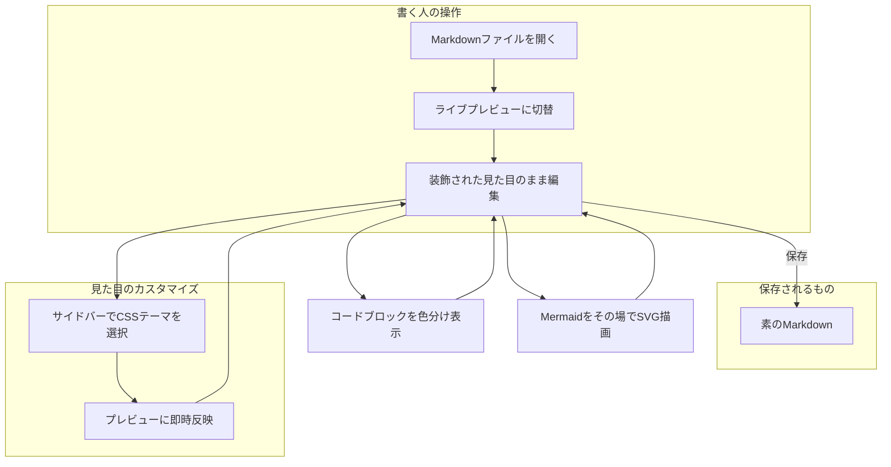

# Markdown Live Preview Editor

**書いた見た目のまま**編集できる、Markdownのライブプレビュー拡張機能です。

このドキュメントを実際に編集してみてください。カーソルが乗っていない行は装飾された見た目のまま、カーソルが乗った行だけ`**`や`#`が生のMarkdown記法として見えます。

## なぜObsidianライクなのか

VS Code標準のMarkdownプレビューは、編集用のペインとプレビュー用のペインが左右に分かれています。この拡張機能はその2つを1つにまとめ、*プレビューそのものを直接編集*できるようにします。

> 保存されるファイルの中身は、常に素のMarkdownです。
> 特殊な独自フォーマットに変換されることはありません。

## 主な機能

- ライブプレビュー編集(このドキュメントもその場で編集できます)
- シンタックスハイライト付きコードブロック
- Mermaidダイアグラムのその場描画
- サイドバーから切り替えられるCSSテーマ
- ~~生のMarkdownソースだけを見ながら書くつらさ~~ ← これとはもうお別れ

### 導入手順

1. VS Codeの拡張機能ビューで検索してインストールする
2. `.md`ファイルを開き、タイトルバーの切替アイコンをクリックする
3. プレビュー上で直接編集を始める

### 進捗メモ

- [x] プレビューをそのまま編集できるようにする
- [x] コードブロックを色分け表示する
- [ ] テーブルの生編集をもっと滑らかにする

## コード例

`inline code`だけでなく、フェンス付きのコードブロックも言語ごとに色分けされます。

```python
def toggle_live_preview(path: str) -> None:
    """.md を開いたときに、装飾されたプレビューへ自動で切り替える"""
    print(f"{path} をライブプレビューで開きました")
```

## 仕組み


もう少し大きな図でも、縮小されずそのままのサイズで描画されます(ドラッグでパン、`Ctrl`+ホイールまたはツールバーの+/-でズーム)。



## 見た目のカスタマイズ

サイドバーの「CSS Themes」から、プレビューの見た目を変えるスタイルを切り替えられます。


もっと詳しく知りたい方は[GitHubリポジトリ](https://github.com/t-shoot/md-live-preview-editor)もご覧ください。

---

## 動作確認用サンプル

このセクションは、対応している記法を一通り目視確認するためのものです。

### 見出しレベル(h1〜h6)

#### 見出しレベル4

##### 見出しレベル5

###### 見出しレベル6

### 空白セルを含むテーブル

一部のセルが空でも、列がずれずに元の位置のまま表示されることを確認してください。

| 名前 | 備考 | 状態 |
| --- | --- | --- |
| Alice |  | OK |
|  | 保留 | NG |
| Bob | 完了 |  |

## 対応フォーマット早見表

| 記法 | 表示 |
| --- | --- |
| 見出し | `#`〜`######` |
| 強調 | `**太字**` / `*斜体*` |
| リスト | 箇条書き・番号付き・タスク |
| コード | インライン・フェンス付き(色分け) |
| 図 | Mermaidをその場でSVG描画 |
